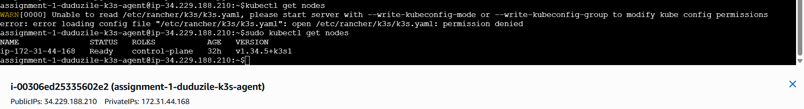
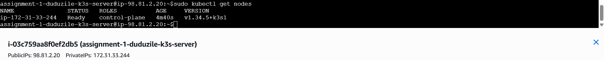
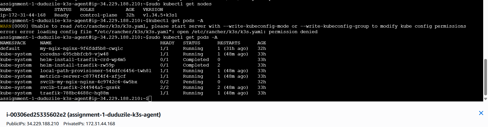
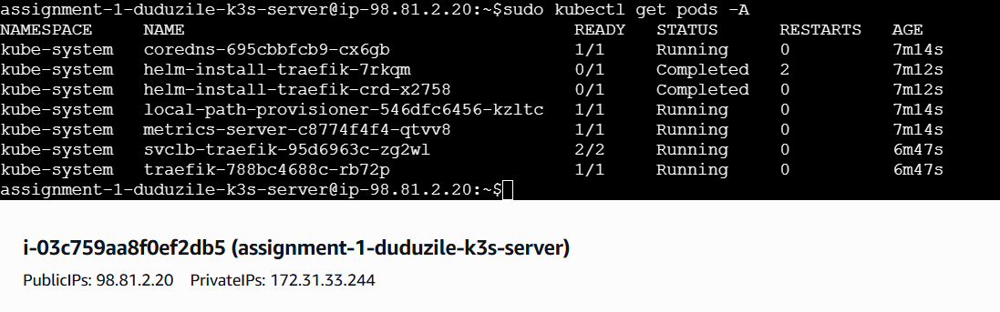
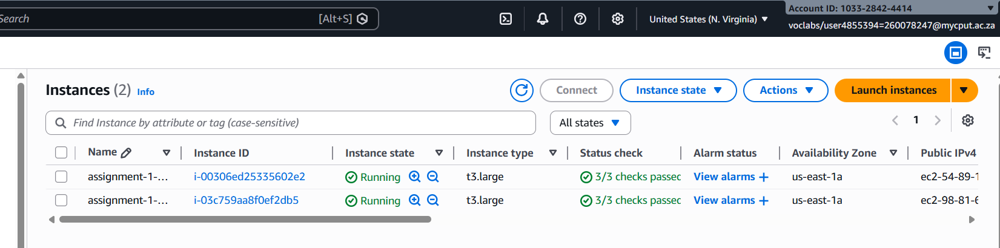
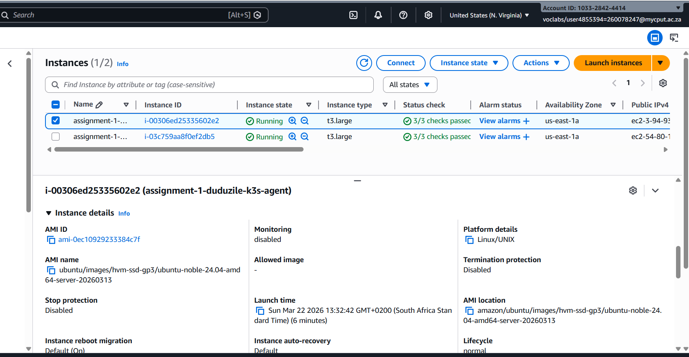
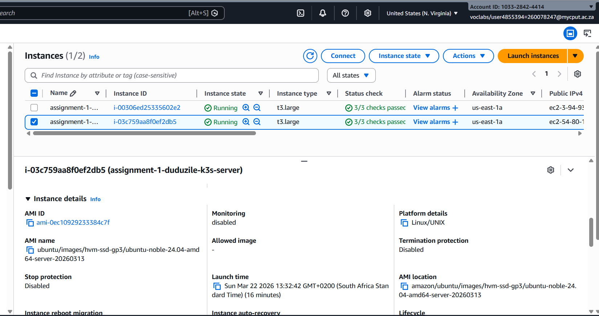
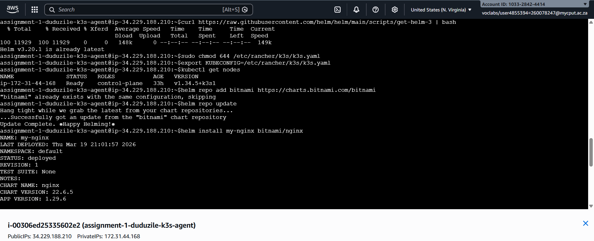
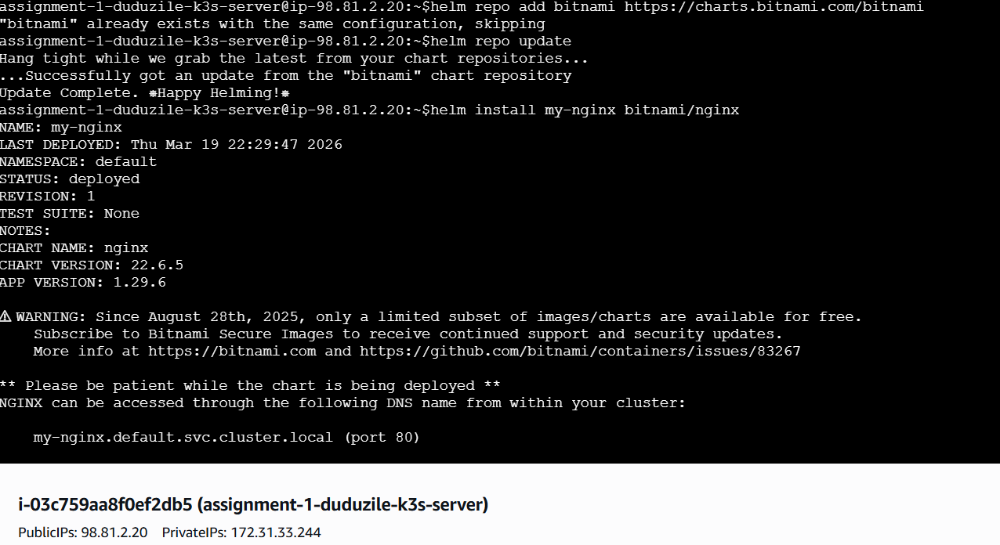

# https://github.com/260078247/assignment-1-duduzile-trisha-mbhele.git

Name: Duduzile Trisha Mbhele
Student Number: 260078247

Repository: assignment-1-duduzile-trisha-mbhele

STEP 1

# Set AWS region
export AWS_REGION="us-east-1"

# Key pair name you just created
export KEY_NAME="my-k3s-key"

# STEP 1.2 — Create Security Group

# Run this to create a security group for your K3s cluster:
export SG_ID=$(aws ec2 create-security-group \
  --group-name k3s-ha-sg \
  --description "K3s HA cluster security group" \
  --vpc-id $(aws ec2 describe-vpcs --filters "Name=isDefault,Values=true" --query "Vpcs[0].VpcId" --output text --region $AWS_REGION) \
  --region $AWS_REGION \
  --query GroupId --output text)

echo "Security group created: $SG_ID"

# SSH
aws ec2 authorize-security-group-ingress \
  --group-id $SG_ID \
  --protocol tcp --port 22 \
  --cidr 0.0.0.0/0 \
  --region $AWS_REGION

# Kubernetes API (6443)
aws ec2 authorize-security-group-ingress \
  --group-id $SG_ID \
  --protocol tcp --port 6443 \
  --cidr 0.0.0.0/0 \
  --region $AWS_REGION

# etcd (2379-2380, inter-node only)
aws ec2 authorize-security-group-ingress \
  --group-id $SG_ID \
  --protocol tcp --port 2379-2380 \
  --source-group $SG_ID \
  --region $AWS_REGION

# Kubelet (10250)
aws ec2 authorize-security-group-ingress \
  --group-id $SG_ID \
  --protocol tcp --port 2379-2380 \
  --source-group $SG_ID \
  --region $AWS_REGION

# Flannel VXLAN (8472 UDP)
aws ec2 authorize-security-group-ingress \
  --group-id $SG_ID \
  --protocol udp --port 8472 \
  --source-group $SG_ID \
  --region $AWS_REGION

# NodePort range (30000-32767)

aws ec2 authorize-security-group-ingress \
  --group-id $SG_ID \
  --protocol tcp --port 30000-32767 \
  --cidr 0.0.0.0/0 \
  --region $AWS_REGION

# STEP 1.3 — Find Latest Ubuntu 22.04 LTS AMI

export AMI_ID=$(aws ec2 describe-images \
  --owners 099720109477 \
  --filters "Name=name,Values=ubuntu/images/hvm-ssd/ubuntu-jammy-22.04-amd64-server-*" \
  --query "sort_by(Images,&CreationDate)[-1].ImageId" \
  --output text \
  --region $AWS_REGION)

# STEP 1.4 — Launch 3 EC2 Instances (Masters)

for i in 1 2 3; do
  aws ec2 run-instances \
    --image-id $AMI_ID \
    --instance-type t3.large \
    --key-name $KEY_NAME \
    --security-group-ids $SG_ID \
    --subnet-id $(aws ec2 describe-subnets --filters "Name=vpc-id,Values=$(aws ec2 describe-vpcs --filters Name=isDefault,Values=true --query Vpcs[0].VpcId --output text --region $AWS_REGION)" --query "Subnets[0].SubnetId" --output text --region $AWS_REGION) \
    --associate-public-ip-address \
    --tag-specifications "ResourceType=instance,Tags=[{Key=Name,Value=k3s-master-$i}]" \
    --region $AWS_REGION \
    --query "Instances[0].InstanceId" --output text
done

#  STEP 1.5 — Get Private and Public IPs of Instances
aws ec2 describe-instances \
  --filters "Name=tag:Name,Values=k3s-master-*" "Name=instance-state-name,Values=running" \
  --query "Reservations[].Instances[].[Tags[?Key=='Name']|[0].Value,PrivateIpAddress,PublicIpAddress]" \
  --output table \
  --region $AWS_REGION

# 1. SSH Into Each Master Node
Use Public IPs from Step 1.4:
ssh -i my-k3s-key.pem ubuntu@<MASTER_PUBLIC_IP>
•	Replace <MASTER_PUBLIC_IP> with the actual IP
•	Example for master-1:
ssh -i my-k3s-key.pem ubuntu@3.4.5.6

# 2. Update OS Packages
sudo apt update -y
sudo apt upgrade -y

# 3. Install Required Utilities
sudo apt install -y curl wget vim git

# 4. Disable Swap

Kubernetes requires swap to be off:
sudo swapoff -a
sudo sed -i '/ swap / s/^\(.*\)$/#\1/g' /etc/fstab

# 6. Enable IP Tables Bridging
Required for container networking:
sudo modprobe br_netfilter
echo "br_netfilter" | sudo tee /etc/modules-load.d/k8s.conf

sudo tee /etc/sysctl.d/k8s.conf<<EOF
net.bridge.bridge-nf-call-ip6tables = 1
net.bridge.bridge-nf-call-iptables = 1
EOF

sudo sysctl --system

# 7. Set Hostname (Optional, but recommended)
sudo hostnamectl set-hostname k3s-master-1   # change to master-2 or master-3 on other nodes

🔹 Step 3: Install K3s HA Cluster
Important: We install master-1 first (bootstrap the cluster), then join master-2 and master-3.

# 1. On Master-1 (Bootstrap)
SSH into master-1:
ssh -i my-k3s-key.pem ubuntu@3.95.24.101
Install K3s as the first server:
curl -sfL https://get.k3s.io | INSTALL_K3S_VERSION="v1.30.8+k3s1" sh -s - server \
  --cluster-init \
  --server https://172.31.92.179:6443 \
  --tls-san 3.95.24.101

# Explanation:
•	--cluster-init → bootstrap first master
•	--server https://PRIVATE_IP:6443 → use master-1 private IP for internal etcd communication
•	--tls-san → include public IP for kubectl access

# Check status:
sudo systemctl status k3s
sudo k3s kubectl get nodes

# 2. On Master-2 (Join Cluster)
SSH into master-2:
ssh -i my-k3s-key.pem ubuntu@13.218.145.77
Get the K3s join token from master-1:
ssh -i my-k3s-key.pem ubuntu@3.95.24.101 "sudo cat /var/lib/rancher/k3s/server/node-token"
Copy the token output. Then on master-2, install K3s joining the cluster:
curl -sfL https://get.k3s.io | INSTALL_K3S_VERSION="v1.30.8+k3s1" sh -s - server \
  --server https://172.31.92.179:6443 \
  --token <PASTE_TOKEN_HERE>

# Check status:
sudo systemctl status k3s
sudo k3s kubectl get nodes

# 3. On Master-3 (Join Cluster)
SSH into master-3:
ssh -i my-k3s-key.pem ubuntu@44.211.204.51
Use the same token from master-1, then install K3s:
curl -sfL https://get.k3s.io | INSTALL_K3S_VERSION="v1.30.8+k3s1" sh -s - server \
  --server https://172.31.92.179:6443 \
  --token <PASTE_TOKEN_HERE>

# Check status:
sudo systemctl status k3s
sudo k3s kubectl get nodes

# Verify Cluster
SSH to any master and run:
sudo k3s kubectl get nodes
sudo k3s kubectl get pods -A

# Master-2 and 3 (join Cluster) N.B//you will do these commands in each cluster 
master-1
TO GET TOKEN: sudo cat /var/lib/rancher/k3s/server/node-token
exit
ssh -i my-k3s-key.pem ubuntu@<PUBLIC IP MASTER 2>
curl -sfL https://get.k3s.io | sh -s - server \
  --server https://<MASTER-1 PRIVATE IP>:6443 \ 
  --token <PASTE_TOKEN_HERE> \
  --node-ip=<MASTER-2 PRIVATE IP>
sudo systemctl status k3s

# REPEAT THE SAME COMMANDS ON MASTER-3

# K3s High-Availability Cluster Architecture
This project demonstrates the deployment of a highly available Kubernetes cluster using K3s on AWS EC2 instances. The architecture consists of three control-plane (master) nodes configured with embedded etcd to ensure fault tolerance and reliability.
# Cluster Design
The cluster is composed of:
•	3 K3s server nodes (masters) running on AWS EC2 (t3.large)
•	Ubuntu 22.04 LTS as the operating system
•	Embedded etcd datastore for cluster state management
# Each node runs the following Kubernetes control plane components:
•	API Server
•	Scheduler
•	Controller Manager
•	etcd (distributed across all three nodes)
# High Availability
High availability is achieved through:
•	Multiple control-plane nodes (3 masters)
•	Distributed etcd cluster for state replication
•	Internal communication via private IP addresses
If one node fails, the cluster continues to operate using the remaining nodes, ensuring no single point of failure.
# Networking
•	Flannel (VXLAN) is used as the Container Network Interface (CNI)
•	Nodes communicate using private IPs within the AWS VPC
•	Required ports (6443, 2379–2380, 8472, etc.) are opened via a security group
# Application Deployment
A sample Nginx application was deployed using Kubernetes:
•	Created via kubectl create deployment
•	Exposed using a NodePort service
•	Accessible externally via EC2 public IP and NodePort
# Summary
This architecture provides:
•	Lightweight Kubernetes (K3s)
•	High availability with embedded etcd
•	Scalable and fault-tolerant cluster design
•	Real-world cloud deployment using AWS EC2

# Commit 1:
Initial setup: provisioned AWS EC2 instances and configured security groups for K3s HA cluster
# Commit 2:
Installed and configured K3s HA cluster with 3 master nodes using embedded etcd
# Commit 3:
Deployed Nginx application and exposed service via NodePort for external access

# Cluster Verification
# Nodes

# Pods

# running instances

# Deployment verification

# Reflection
In this assignment, I learned how to design, deploy, and manage a highly available Kubernetes cluster using K3s on AWS EC2. The process gave me practical experience with cloud infrastructure, container orchestration, and distributed systems.
One of the key skills I developed was working with AWS services, particularly EC2. I learned how to create and configure instances, manage security groups, and understand the importance of networking and port configurations. Setting up the infrastructure using AWS CLI commands helped me understand automation and reproducibility in cloud environments.
Deploying the K3s cluster was a significant learning experience. I gained a deeper understanding of how Kubernetes control plane components work together, including the API server, scheduler, and controller manager. Using embedded etcd for the datastore helped me understand how cluster state is maintained and synchronized across multiple nodes to achieve high availability.
I also learned the importance of using private IP addresses for internal communication between nodes. This ensures secure and efficient communication within the cluster. Additionally, I understood why only the first master node initializes the cluster while the others join using a token.
One challenge I encountered was during the cluster setup when some nodes failed to join correctly. This was due to incorrect token usage and configuration errors. Troubleshooting these issues helped me improve my debugging skills, especially by using system logs (journalctl) and checking service statuses. It also taught me the importance of carefully following configuration steps and understanding command parameters.
Deploying the Nginx application and exposing it using a NodePort service helped me understand how Kubernetes manages workloads and networking. Successfully accessing the application through a browser confirmed that the cluster was functioning correctly and that external traffic could reach the deployed service.
Overall, this assignment strengthened my understanding of Kubernetes architecture, high availability concepts, and cloud-based deployments. It also improved my confidence in using command-line tools and troubleshooting distributed systems. These skills are highly relevant for modern DevOps and cloud engineering roles.
In conclusion, this project provided valuable hands-on experience in building a resilient and scalable Kubernetes environment, and it has prepared me for more advanced cloud-native applications in the future.
